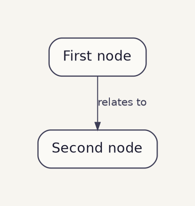

Render Graphviz `.dot` files to PNG using the same warm-paper styling used by `projects/diagnostics/content-model-object-graph.dot`. Use this for technical/reference diagrams that live next to a doc, not for designed infographics (use `/pdm:infographic` for those).

## When to use this vs. `/pdm:infographic`

| Use this command | Use `/pdm:infographic` |
|---|---|
| Object graphs, dependency maps, state machines | Editorial/narrative visuals |
| Lives next to a project doc and gets embedded inline | Lives in `infographics/<project>/<week>/` and links from the weekly log |
| Will be regenerated as the model evolves | One-shot designed artifact |
| Source is a `.dot` file under version control | Source is HTML + companion `.md` |

## Modes

### 1. Regenerate (default — when the file already exists)

```bash
dot -Tpng <path>.dot -o <path>.png
```

Behaviour:
- Run `dot -Tpng` against the supplied `.dot` file.
- Write the PNG alongside it with the same basename.
- Overwrite any existing PNG (the regeneration is the point).
- Print the output path and file size.

### 2. Batch (when given a directory)

Find every `*.dot` file under the directory (non-recursive by default) and regenerate each PNG. Useful when several diagrams in a project folder need to be refreshed at once.

```bash
for f in <dir>/*.dot; do dot -Tpng "$f" -o "${f%.dot}.png"; done
```

### 3. Scaffold (when the user prefixes the path with `new`)

If $ARGUMENTS starts with `new ` (e.g. `new projects/diagnostics/state-machine.dot`):

1. Confirm the target directory exists; create it if not.
2. Write a starter `.dot` file using the template below.
3. Render it once so the user has a working PNG to view.
4. Tell the user where to edit the source and how to regenerate.

## Starter template

Match the warm-paper palette from `~/.claude/skills/infographic/references/visual-design.md`. Use this exact preamble so all `/pdm:diagram` outputs feel consistent with the rest of the vault.



## Convention

- **Place the `.dot` and `.png` next to the doc that embeds the diagram.** Not in `infographics/` (that's for designed infographics) and not in `images/` (that's for general screenshots). Co-location keeps the source under the same project folder as the prose it supports.
- **Embed the PNG with the standard Obsidian wikilink:** `![[diagram-name.png]]`. If the PNG lives next to the doc that embeds it, no path prefix is needed.
- **Keep an ASCII fallback in the doc.** Per the vault's product-writing rules, ASCII diagrams capture structure without rendering. The PNG is the visual; the ASCII below it is the text source of truth for skim/grep/quote.
- **Solid vs. dashed edges:** solid for the primary flow, dashed for lifecycle, registry, optional, or "drawn from" relationships. Pattern matches `content-model-object-graph.dot`.

## Prerequisites

Graphviz must be installed:

```bash
which dot || brew install graphviz
```

If `dot` is missing, install it before running and tell the user what was installed.

## Output

Print:
- Path of the rendered PNG.
- File size.
- A one-line reminder of how to embed (`![[<basename>.png]]`).

Example:
```
Rendered: projects/diagnostics/content-model-object-graph.png (37 KB)
Embed in a vault doc with: ![[content-model-object-graph.png]]
```

## Notes

- Don't edit the surrounding doc unless the user asks. This command is a renderer, not a content tool.
- Don't version PNGs (`-v1`, `-v2`). Diagrams are regenerated in place; git tracks history.
- Don't move or rename existing `.dot` files. Regenerate against the path given.
- If the user supplies a `.dot` path that doesn't exist and didn't prefix with `new`, ask whether they meant to scaffold rather than silently creating one.
